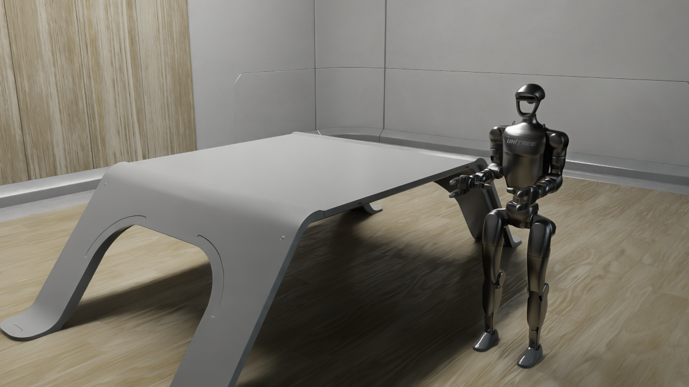
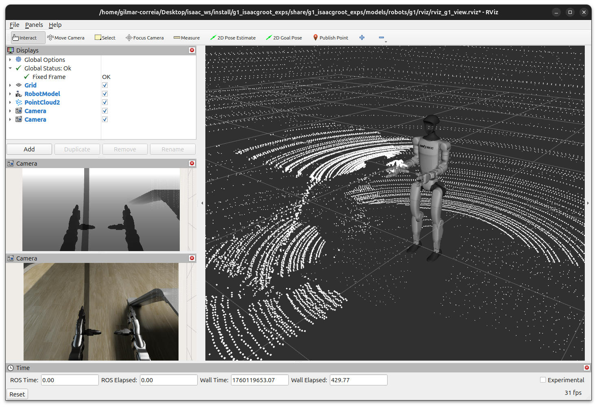
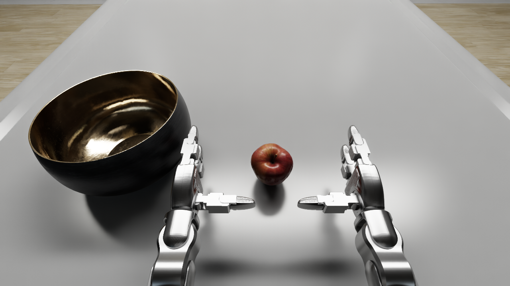
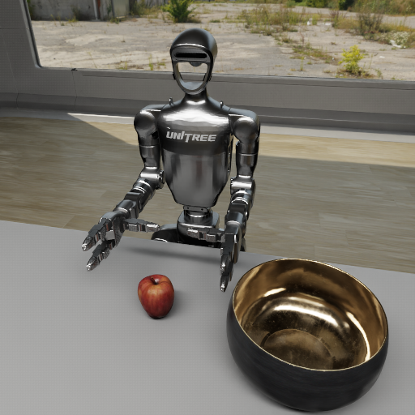

# G1_IsaacGroot_Exps

**Humanoid Robotics Engineer – Technical Challenge: Generalist Behavior via NVIDIA Isaac Gr00t N1.5**

This repository aims to integrate and control the **Unitree G1 humanoid robot** through **NVIDIA Isaac Gr00t N1.5**, leveraging the **Isaac Sim 5.0** simulation environment and **ROS 2 Jazzy** middleware.

The following technology stack was used in local development:

* Ubuntu 24.04
* Isaac Sim 5.0
* Isaac Gr00t N1.5
* CUDA Toolkit 12.8
* Anaconda (for virtual environment management)
* Python 3.10
* ROS 2 Jazzy
* NVIDIA RTX 3080 GPU

In cloud development:

* Ubuntu 22.04
* Isaac Sim 5.0
* Isaac Gr00t N1.5
* CUDA Toolkit 12.4
* Anaconda (for virtual environment management)
* Python 3.10
* ROS 2 Humble
* NVIDIA L4 GPU

---

## 1. Installation

Choose one of the following setup options:

[1.1. Local Configuration](#11-local-configuration)  
[1.2. Docker Environment](#12-docker-environment)

--- 

### 1.1. Local Configuration

Create a workspace folder and clone this repository inside it:

```bash
cd $HOME/Desktop
mkdir -p isaac_ws/src
cd isaac_ws/src
git clone https://github.com/GilmarCorreia/g1_isaacgroot_exps.git

cd g1_isaacgroot_exps
./init_submodules.sh
mkdir downloads
```

Add the following environment variables to your shell:

```bash
isaac_text="
# Isaac Workspace Setup
export ISAAC_WS=$HOME/Desktop/isaac_ws
export ISAAC_EXPS=$HOME/Desktop/isaac_ws/src/g1_isaacgroot_exps
"
sudo echo "$isaac_text" >> ~/.bashrc
source ~/.bashrc
```

#### 1.1.1. ROS 2 

##### 1.1.1.1. Humble

Install **ROS 2 Humble** following the official guide:
👉 [https://docs.ros.org/en/humble/Installation/Ubuntu-Install-Debs.html](https://docs.ros.org/en/humble/Installation/Ubuntu-Install-Debs.html)

For convenience, the main commands are included below:

```bash
sudo apt install software-properties-common
sudo add-apt-repository universe
sudo apt update && sudo apt install curl -y
export ROS_APT_SOURCE_VERSION=$(curl -s https://api.github.com/repos/ros-infrastructure/ros-apt-source/releases/latest | grep -F "tag_name" | awk -F\" '{print $4}')
curl -L -o /tmp/ros2-apt-source.deb "https://github.com/ros-infrastructure/ros-apt-source/releases/download/${ROS_APT_SOURCE_VERSION}/ros2-apt-source_${ROS_APT_SOURCE_VERSION}.$(. /etc/os-release && echo ${UBUNTU_CODENAME:-${VERSION_CODENAME}})_all.deb"
sudo dpkg -i /tmp/ros2-apt-source.deb
sudo apt update && sudo apt install ros-dev-tools
sudo apt install ros-humble-desktop ros-humble-xacro ros-humble-joint-state-publisher-gui
```

Then, add the following environment configuration:


```bash
ros_text="
# ROS 2 Humble
source /opt/ros/humble/setup.bash
source $ISAAC_WS/install/setup.bash
export ROS_DISTRO=humble
export RMW_IMPLEMENTATION=rmw_fastrtps_cpp
"
sudo echo "$ros_text" >> ~/.bashrc
source ~/.bashrc
```

##### 1.1.1.2. Jazzy

Install **ROS 2 Jazzy** following the official guide:
👉 [https://docs.ros.org/en/jazzy/Installation/Ubuntu-Install-Debs.html](https://docs.ros.org/en/jazzy/Installation/Ubuntu-Install-Debs.html)

For convenience, the main commands are included below:

```bash
sudo apt install software-properties-common
sudo add-apt-repository universe
sudo apt update && sudo apt install curl -y
export ROS_APT_SOURCE_VERSION=$(curl -s https://api.github.com/repos/ros-infrastructure/ros-apt-source/releases/latest | grep -F "tag_name" | awk -F\" '{print $4}')
curl -L -o /tmp/ros2-apt-source.deb "https://github.com/ros-infrastructure/ros-apt-source/releases/download/${ROS_APT_SOURCE_VERSION}/ros2-apt-source_${ROS_APT_SOURCE_VERSION}.$(. /etc/os-release && echo ${UBUNTU_CODENAME:-${VERSION_CODENAME}})_all.deb"
sudo dpkg -i /tmp/ros2-apt-source.deb
sudo apt update && sudo apt install ros-dev-tools
sudo apt install ros-jazzy-desktop ros-jazzy-xacro ros-jazzy-joint-state-publisher-gui
```

Then, add the following environment configuration:

```bash
ros_text="
# ROS 2 Jazzy
source /opt/ros/jazzy/setup.bash
source $ISAAC_WS/install/setup.bash
export ROS_DISTRO=jazzy
export RMW_IMPLEMENTATION=rmw_fastrtps_cpp
"
sudo echo "$ros_text" >> ~/.bashrc
source ~/.bashrc
```

#### 1.1.2. Isaac Sim 5.0

Download and install **Isaac Sim 5.0** from the following link:
👉 [https://download.isaacsim.omniverse.nvidia.com/isaac-sim-standalone-5.0.0-linux-x86_64.zip](https://download.isaacsim.omniverse.nvidia.com/isaac-sim-standalone-5.0.0-linux-x86_64.zip)

Then extract and configure the environment:

```bash
cd $ISAAC_EXPS/downloads
wget https://download.isaacsim.omniverse.nvidia.com/isaac-sim-standalone-5.0.0-linux-x86_64.zip
sudo apt-get install p7zip-full
7z x isaac-sim-standalone-5.0.0-linux-x86_64.zip -o isaac-sim-standalone-5.0.0-linux-x86_64

isaac_sim_text="
# Isaac Sim 5.0 Setup
export isaac_sim_package_path=$ISAAC_EXPS/downloads/isaac-sim-standalone-5.0.0-linux-x86_64
export LD_LIBRARY_PATH=$LD_LIBRARY_PATH:$isaac_sim_package_path/exts/isaacsim.ros2.bridge/$ROS_DISTRO/lib
"
sudo echo "$isaac_sim_text" >> ~/.bashrc
source ~/.bashrc
```

#### 1.1.3. CUDA Toolkit 

##### 1.1.3.1. 12.4

Install **CUDA Toolkit 12.4** following the official instructions:
👉 [https://developer.nvidia.com/cuda-12-4-0-download-archive](https://developer.nvidia.com/cuda-12-4-0-download-archive)

```bash
wget https://developer.download.nvidia.com/compute/cuda/repos/ubuntu2204/x86_64/cuda-ubuntu2204.pin
sudo mv cuda-ubuntu2204.pin /etc/apt/preferences.d/cuda-repository-pin-600
wget https://developer.download.nvidia.com/compute/cuda/12.4.0/local_installers/cuda-repo-ubuntu2204-12-4-local_12.4.0-550.54.14-1_amd64.deb
sudo dpkg -i cuda-repo-ubuntu2204-12-4-local_12.4.0-550.54.14-1_amd64.deb
sudo cp /var/cuda-repo-ubuntu2204-12-4-local/cuda-*-keyring.gpg /usr/share/keyrings/
sudo apt-get update
sudo apt-get -y install cuda-toolkit-12-4
sudo apt-get install -y cuda-drivers
```

##### 1.1.3.2. 12.8

Install **CUDA Toolkit 12.8** following the official instructions:
👉 [https://developer.nvidia.com/cuda-12-8-0-download-archive](https://developer.nvidia.com/cuda-12-8-0-download-archive)

```bash
wget https://developer.download.nvidia.com/compute/cuda/repos/ubuntu2404/x86_64/cuda-ubuntu2404.pin
sudo mv cuda-ubuntu2404.pin /etc/apt/preferences.d/cuda-repository-pin-600
wget https://developer.download.nvidia.com/compute/cuda/12.8.0/local_installers/cuda-repo-ubuntu2404-12-8-local_12.8.0-570.86.10-1_amd64.deb
sudo dpkg -i cuda-repo-ubuntu2404-12-8-local_12.8.0-570.86.10-1_amd64.deb
sudo cp /var/cuda-repo-ubuntu2404-12-8-local/cuda-*-keyring.gpg /usr/share/keyrings/
sudo apt-get update
sudo apt-get -y install cuda-toolkit-12-8
sudo apt-get install -y nvidia-open
sudo reboot
```

#### 1.1.4. Anaconda Environment

Install **Anaconda** to manage Python environments:

```bash
cd $ISAAC_EXPS/downloads
wget https://repo.anaconda.com/archive/Anaconda3-2025.06-0-Linux-x86_64.sh
bash Anaconda3-2025.06-0-Linux-x86_64.sh
```

Then, create and configure the environment for **Isaac Gr00t**:

```bash
eval "$(/home/gilmar/anaconda3/bin/conda shell.bash hook)"

conda create -n gr00t python=3.10
conda activate gr00t

cd $ISAAC_EXPS/modules/Isaac-GR00T
pip install --upgrade setuptools
pip install -e .[base]
pip install --no-build-isolation flash-attn==2.7.1.post4
pip install json_numpy uvicorn fastapi
```

#### 1.1.5. ROS 2 Package Build

Build the ROS 2 package and install dependencies:

```bash
conda deactivate
conda deactivate
sudo apt-get install python3-pip
pip install json_numpy
cd $ISAAC_WS
colcon build
```

#### 1.1.6. Download the Dataset for Fine-Tuning (Optional)

Download the **PhysicalAI Robotics GR00T Teleoperation** dataset for potential fine-tuning:

- Test 1:

```bash
cd $ISAAC_EXPS/modules/Isaac-GR00T
conda deactivate
conda deactivate
pip install -U "huggingface_hub[cli]"
hf auth login
huggingface-cli download --repo-type dataset unitreerobotics/G1_BlockStacking_Dataset --local-dir ./datasets/G1_BlockStacking_Dataset/
cp examples/UnitreeG1/unitree_g1_blocks__modality.json datasets/G1_BlockStacking_Dataset/meta/modality.json

conda activate gr00t
python scripts/load_dataset.py --data_path /datasets/G1_BlockStacking_Dataset/ --embodiment_tag new_embodiment --plot-state-action
```
- Test 2:

```bash
cd $ISAAC_EXPS/modules/Isaac-GR00T
conda deactivate
conda deactivate
pip install -U "huggingface_hub[cli]"
hf auth login
huggingface-cli download --repo-type dataset nvidia/PhysicalAI-Robotics-GR00T-Teleop-G1 --local-dir ./datasets/

conda activate gr00t
python scripts/load_dataset.py --dataset-path datasets/g1-pick-apple/ --plot-state-action

dataset_list=(
    "datasets/g1-pick-apple/"
    "datasets/g1-pick-pear/"
    "datasets/g1-pick-grapes/"
    "datasets/g1-pick-starfruit/"
)

python scripts/gr00t_finetune.py --dataset-path ${dataset_list[@]} --num-gpus 1 --batch-size 95  --output-dir $ISAAC_EXPS/modules/Isaac-GR00T/checkpoints/full-g1-mix-fruits/ --data-config unitree_g1 --max-steps 15000

python scripts/eval_policy.py --plot --embodiment_tag new_embodiment --model_path $ISAAC_EXPS/modules/Isaac-GR00T/checkpoints/full-g1-mix-fruits/ --data_config unitree_g1 --dataset_path datasets/g1-pick-apple/ --video_backend decord --modality_keys left_arm right_arm
```
---

### 1.2. Docker Environment

*In development.*

---

## 2. Scene Setup and Robot Configuration

The **Isaac Sim 5.0** environment was used to simulate the humanoid robot and its surroundings, leveraging NVIDIA’s provided assets for both the robot and environment.

<p align="center">
  
</p>

ROS 2 topics were created to bridge Isaac Sim with the robot’s actuators and sensors, including:

* `joint_state` and `joint_command` for motor control
* RGB and depth camera image topics
* LIDAR topic for environmental mapping

<p align="center">
  
</p>

To visualize the robot and its sensor data inside RViz, run:

```bash
conda deactivate
conda deactivate
cd $ISAAC_WS/src/g1_isaacgroot_exps
./launch.sh
```

A simplified bridge was implemented to communicate robot state and control commands with **Isaac Gr00t**, exposing ROS 2 interfaces for joint control, camera feedback, and high-level task instructions.

The central component of this architecture is the `gr00t_bridge.py` script, which connects **ROS 2**, **Isaac Gr00t**, and the **Unitree G1** simulation within Isaac Sim, enabling bidirectional communication for natural language–based robot commands.

---

## 3. Examples

Data streams such as joint positions and RGB camera output are visualized as shown below:

<p align="center">
  
</p>

<p align="center">
  
</p>

### Execution

1. **Start Isaac Sim** with the scene located at: `g1_isaacgroot_exps/worlds/simple_room_G1_test.usd`

Open a terminal and run:

```bash
conda activate gr00t
cd $ISAAC_EXPS/modules/Isaac-GR00T
python scripts/inference_service.py --model-path nvidia/GR00T-N1.5-3B --data_config unitree_g1_full_body --http_server --server
```

2. **Start the ROS 2 Bridge:** In another terminal, run:

```bash
conda deactivate
conda deactivate
ros2 run g1_isaacgroot_exps gr00t_bridge.py
```

3. **Send high-level commands to the robot:** In another terminal, use the following command to instruct the robot:

```bash
conda deactivate
conda deactivate
ros2 action send_goal /groot_command g1_isaacgroot_exps/action/Instruction "{instruction: 'grab the apple'}"
```

Observe the corresponding motion and interaction within Isaac Sim.

---

## 4. Project Architecture

The system integrates multiple components across simulation, control, and inference, forming a complete humanoid behavior loop.

```
┌──────────────────────────────┐
│        User / Operator       │
│ (Sends natural language cmd) │
└──────────────┬───────────────┘
               │
               ▼
┌──────────────────────────────┐
│   ROS 2 Action Client Node   │
│  (/groot_command interface)  │
└──────────────┬───────────────┘
               │
               ▼
┌──────────────────────────────┐
│        GR00T Bridge          │
│ (gr00t_bridge.py)            │
│ - Receives high-level goals  │
│ - Publishes ROS2 commands    │
│ - Subscribes to joint states │
└──────────────┬───────────────┘
               │
               ▼
┌──────────────────────────────┐
│      Isaac Gr00t Engine      │
│ (LLM-based reasoning model)  │
│ - Interprets user intents    │
│ - Generates robot actions    │
└──────────────┬───────────────┘
               │
               ▼
┌──────────────────────────────┐
│        Isaac Sim 5.0         │
│ (Unitree G1 Simulation)      │
│ - Executes joint commands    │
│ - Publishes sensor data      │
└──────────────┬───────────────┘
               │
               ▼
┌──────────────────────────────┐
│          ROS 2 Layer         │
│ - Topics: /joint_state, /cmd │
│ - Bridges Isaac <-> Gr00t    │
└──────────────────────────────┘
```

This architecture allows **bidirectional communication** between simulation and the AI reasoning layer (Isaac Gr00t), enabling a humanoid robot to interpret natural language commands and execute complex behaviors in simulation.

The `gr00t_bridge.py` node acts as the **ROS 2 middleware bridge**, translating between the **Isaac Gr00t inference server** and **ROS 2 topics/actions** that control the Unitree G1 humanoid in real time.

---

## 5. Hardware Considerations

The experiments presented in this project were conducted using an **NVIDIA RTX 3080 GPU (10 GB VRAM)**.

While this configuration supports **Isaac Sim** and basic **inference with Isaac Gr00t**, it **does not provide sufficient memory** for **fine-tuning** or large-scale training of the Gr00t model.
Such operations require **more powerful hardware**, ideally with **at least 24 GB VRAM** (e.g., RTX 4090, A6000, or A100) or access to **multi-GPU / cloud-based compute environments**.

In this setup, only **inference and interaction** were tested — fine-tuning or model adaptation to the Unitree G1’s custom behavior datasets would require **high-memory GPU servers** or **NVIDIA DGX-class systems**.

---

## 6. References

* [ROS 2 Jazzy Installation](https://docs.ros.org/en/jazzy/Installation/Ubuntu-Install-Debs.html)
* [NVIDIA Isaac Gr00t Repository](https://github.com/NVIDIA/Isaac-GR00T/tree/main)
* [NVIDIA Developer Forum – Livox MID360](https://forums.developer.nvidia.com/t/livox-mid360/283074/6)
* [Isaac Sim ROS 2 Tutorials](https://docs.isaacsim.omniverse.nvidia.com/latest/ros2_tutorials/tutorial_ros2_rtx_lidar.html)
* [Isaac Sim Robot Setup Tutorials](https://docs.isaacsim.omniverse.nvidia.com/5.0.0/robot_setup_tutorials/tutorial_gui_simple_robot.html)
* [Unitree G1 User Manual (2025)](https://reliablerobotics.ai/wp-content/uploads/2025/03/G1-User-Manual_compressed.pdf)
* [Isaac Sim Camera and Depth Sensor Assets](https://docs.isaacsim.omniverse.nvidia.com/latest/assets/usd_assets_camera_depth_sensors.html)
* [Unitree ROS Packages](https://github.com/unitreerobotics/unitree_ros/tree/master)
* [SensorLab Quick Start Guide (2023)](https://sensorlab.arizona.edu/sites/default/files/2023-07/Quick%20Start%20Guide.pdf)
* [Embodiment Fine-Tuning](https://github.com/NVIDIA/Isaac-GR00T/blob/main/getting_started/3_0_new_embodiment_finetuning.md)
* [Paper: Language Models as Agents](https://arxiv.org/html/2509.14353v1)
* [Dataset: PhysicalAI Robotics GR00T Teleoperation](https://huggingface.co/datasets/ArtemLykov/PhysicalAI-Robotics-GR00T-Teleop-G1-hand1)
